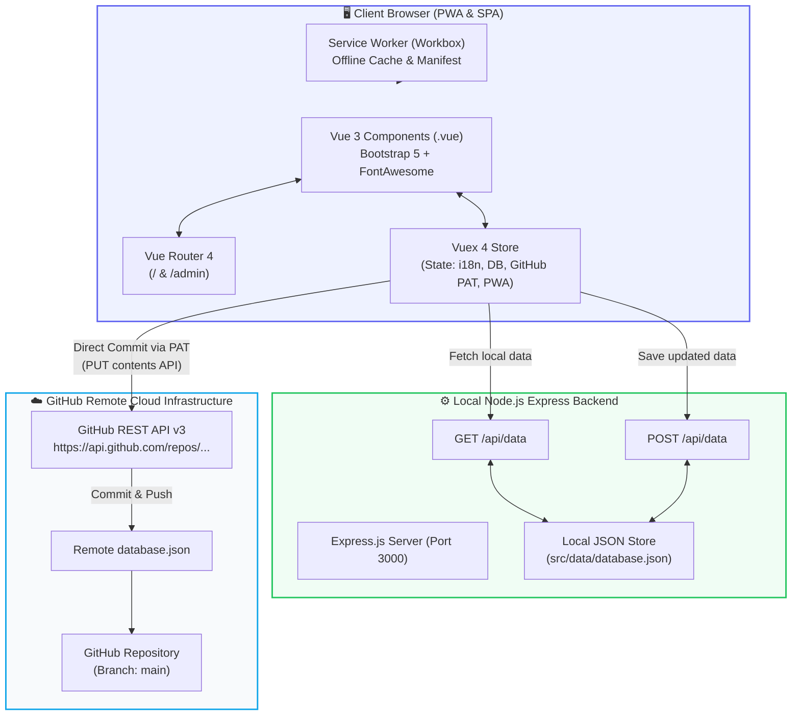
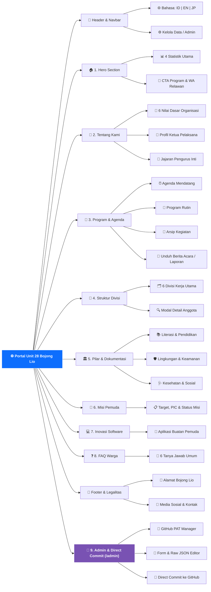
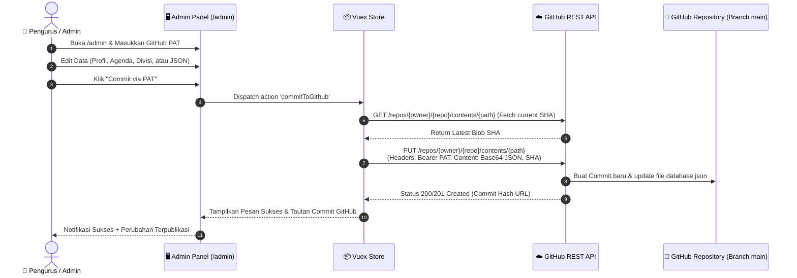

# 🇮🇩 Portal Resmi Karang Taruna Unit 28 — Bojong Lio, Sukamaju, Depok

Selamat datang di repositori resmi **Portal Web Karang Taruna Unit 28 Kampung Bojong Lio, Kelurahan Sukamaju, Kecamatan Cilodong, Kota Depok, Jawa Barat**. 

Website ini dirancang sebagai pusat informasi publik, publikasi agenda, transparansi kelembagaan, serta wadah integrasi inovasi pemuda berbasis digital modern dengan arsitektur **Vue.js 3**, **Vite**, **Vuex**, **PWA**, **Bootstrap 5**, **Node.js Express**, dan **GitHub REST API Direct Commit Integration**.

---

## 📑 Daftar Isi
1. [Ringkasan & Visi Organisasi](#-ringkasan--visi-organisasi)
2. [Tech Stack & Arsitektur Sistem](#-tech-stack--arsitektur-sistem)
3. [Diagram Arsitektur Teknologi](#-diagram-arsitektur-teknologi)
4. [Diagram Peta Navigasi & Konten Website](#-diagram-peta-navigasi--konten-website)
5. [Diagram Struktur Organisasi & Keanggotaan](#-diagram-struktur-organisasi--keanggotaan)
6. [Sistem Divisi & Detail Tanggung Jawab](#-sistem-divisi--detail-tanggung-jawab)
7. [Fitur-Fitur Utama Website](#-fitur-fitur-utama-website)
8. [Integrasi Direct Commit via GitHub PAT](#-integrasi-direct-commit-via-github-pat)
9. [Struktur Direktori Repositori](#-struktur-direktori-repositori)
10. [Panduan Instalasi & Menjalankan Aplikasi](#-panduan-instalasi--menjalankan-aplikasi)
11. [Tata Cara Pengelolaan Konten (JSON Database)](#-tata-cara-pengelolaan-konten-json-database)
12. [Lisensi & Kontak](#-lisensi--kontak)

---

## 🌟 Ringkasan & Visi Organisasi

**Karang Taruna Unit 28 Bojong Lio** adalah organisasi kepemudaan non-partisan di tingkat RW/lingkungan Kampung Bojong Lio, Sukamaju, Kota Depok yang berlandaskan semangat kesetiakawanan sosial, gotong royong, dan pengembangan potensi generasi muda.

### 6 Nilai Dasar Organisasi:
1. **Gotong Royong & Solidaritas**: Mengedepankan kebersamaan dalam setiap aksi sosial kemasyarakatan.
2. **Karakter & Integritas**: Membangun pemuda yang berakhlak mulia, disiplin, dan bertanggung jawab.
3. **Kepedulian Sosial & Tanggap Bencana**: Responsif terhadap kebutuhan warga rentan dan tanggap darurat lingkungan.
4. **Inovasi & Kecakapan Digital**: Pemanfaatan teknologi informasi modern untuk efisiensi organisasi dan pemberdayaan pemuda.
5. **Keberlanjutan Lingkungan**: Menjaga kelestarian, kebersihan, dan penghijauan di wilayah Bojong Lio.
6. **Transparansi & Akuntabilitas**: Keterbukaan informasi program kerja, anggaran, dan pelaporan publik.

---

## 💻 Tech Stack & Arsitektur Sistem

Proyek ini dibangun menggunakan kombinasi teknologi web modern, performa tinggi, dan standar industri:

| Kategori | Teknologi | Deskripsi / Peran dalam Proyek |
|---|---|---|
| **Frontend Framework** | **Vue.js 3** (`vue@^3.5.13`) | Menggunakan arsitektur Single File Component (`.vue`), reactivity system modern, dan pemisahan logika tampilan modular. |
| **Transpiler & Compiler** | **Babel** (`@rollup/plugin-babel`, `@babel/core`, `@babel/preset-env`) | Memastikan kompatibilitas JavaScript generasi terbaru di berbagai peramban web modern dan legacy. |
| **Build Tool & Bundler** | **Vite 8** (`vite@^8.2.2`, `@vitejs/plugin-vue`) | Menyediakan server development super cepat, Hot Module Replacement yang optimal, dan build production yang terkompresi efisien. |
| **State Management** | **Vuex 4** (`vuex@^4.1.0`) | Mengelola state terpusat: multibahasa (ID, EN, JP), data profil, agenda kegiatan, divisi anggota, PWA lifecycle, dan konfigurasi GitHub PAT. |
| **Client-Side Routing** | **Vue Router 4** (`vue-router@^4.5.0`) | Menangani rute halaman utama (Beranda) dan Panel Pengelolaan Konten (Admin Dashboard) secara SPA (*Single Page Application*). |
| **UI Framework & Styling** | **Bootstrap 5** (`bootstrap@^5.3.3`) | Menyediakan grid system responsif, kartu komponen bersih, navigasi, modal, accordion FAQ, dan utilitas tata letak klasik elegan. |
| **Typography & Icons** | **Plus Jakarta Sans** & **FontAwesome 6** | Tipografi resmi yang modern dan koleksi ikon vektor berstandar internasional. |
| **PWA Engine** | **Vite PWA & Workbox** (`vite-plugin-pwa@^1.3.0`) | Web App Manifest, Service Worker otomatis, caching aset offline, dan prompt instalasi aplikasi di perangkat seluler / desktop. |
| **Backend API Server** | **Node.js & Express.js** (`express@^4.21.2`) | Server backend ringan untuk endpoint REST API (`/api/data`), penyimpanan lokal JSON, dan serving aplikasi production. |
| **Database & Penyimpanan** | **Structured JSON Database** (`database.json`) | Penyimpanan data terstruktur berbasis file JSON yang mudah dikelola, dapat disinkronkan, dan siap di-push ke cloud repository. |
| **Integrasi Version Control** | **GitHub REST API (Octokit/Fetch with PAT)** | Fitur Direct Commit langsung dari dashboard website ke repositori GitHub tanpa memerlukan terminal/Git CLI lokal. |
| **Multibahasa (i18n)** | **Tri-Language Engine (ID / EN / JP)** | Dukungan 3 bahasa secara instan (Bahasa Indonesia, English, 日本語) pada seluruh komponen website. |

---

## 📐 Diagram Arsitektur Teknologi

Diagram berikut menggambarkan bagaimana lapisan antarmuka pengguna, state management, backend, dan integrasi GitHub berkomunikasi:



---

## 🗺️ Diagram Peta Navigasi & Konten Website

Diagram navigasi dan struktur modul konten yang disajikan kepada pengunjung:



---

## 👥 Diagram Struktur Organisasi & Keanggotaan

Struktur hierarki kepengurusan Karang Taruna Unit 28 Kampung Bojong Lio:

```mermaid
flowchart TD
    Warga["🏛️ Warga & Pembina Lingkungan (RW / Tokoh Masyarakat)"]:::warga
    
    KTU28["👑 KETUA PELAKSANA<br/><b>Arif Permana Putrasuryana (RT.1)</b>"]:::leader
    WakilKetua["🤝 WAKIL KETUA PELAKSANA<br/><b>Arif (Bono) (RT.1)</b>"]:::leaderSub
    
    Sekre1["📝 SEKRETARIS 1<br/><b>Syahwaulia Oktaviandri (RT.2)</b>"]:::sekre
    Sekre2["📋 SEKRETARIS 2<br/><b>Faradillah Eka (RT.1)</b>"]:::sekre
    
    Benda1["💰 BENDAHARA 1<br/><b>Salwa (RT.1)</b>"]:::benda
    Benda2["🪙 WAKIL BENDAHARA<br/><b>Aqilla (RT.1)</b>"]:::benda

    Warga --> KTU28
    KTU28 --- WakilKetua
    KTU28 --> Sekre1
    Sekre1 --- Sekre2
    KTU28 --> Benda1
    Benda1 --- Benda2

    KTU28 ==> DIV1["📷 DIVISI MULTIMEDIA<br/>& KOMUNIKASI"]:::divBox
    KTU28 ==> DIV2["🛡️ DIVISI KETERTIBAN<br/>& KEAMANAN"]:::divBox
    KTU28 ==> DIV3["📣 DIVISI HUMAS<br/>& ASET ORGANISASI"]:::divBox
    KTU28 ==> DIV4["🏃 DIVISI OLAHRAGA<br/>& KEROHANIAN"]:::divBox
    KTU28 ==> DIV5["🏪 DIVISI KEWIRAUSAHAAN<br/>& SENI BUDAYA"]:::divBox
    KTU28 ==> DIV6["💻 SUB-UNIT SISTEM<br/>INFORMASI DIGITAL"]:::divBox

    %% Anggota Divisi Multimedia
    DIV1 --> M1["Aliefa Ramadanti (RT.1)<br/><i>Dokumentasi & Fotografi</i>"]
    DIV1 --> M2["Ilham Syahwandi<br/><i>Editing Konten & Desain</i>"]
    DIV1 --> M3["Syahwaulia Oktaviandri (RT.2)<br/><i>Koordinator Publikasi</i>"]

    %% Anggota Divisi Keamanan
    DIV2 --> K1["Arif (Bono) (RT.1)<br/><i>Pengamanan Lapangan</i>"]
    DIV2 --> K2["Adit<br/><i>Logistik & Arus Parkir</i>"]

    %% Anggota Divisi Humas
    DIV3 --> H1["Suci Al Desti Febriyani<br/><i>Hubungan Eksternal</i>"]
    DIV3 --> H2["Safira Rahmadini<br/><i>Inventarisasi Aset</i>"]

    %% Anggota Divisi Olahraga
    DIV4 --> O1["Muhammad Azzam Syuhada (RT.5)<br/><i>Penyelenggara Turnamen</i>"]
    DIV4 --> O2["Randi Gunawan (RT.5)<br/><i>Kebugaran & Kerohanian</i>"]

    %% Anggota Divisi Kewirausahaan
    DIV5 --> W1["Khalaf Aidil Muzhaffar<br/><i>Ekonomi Kreatif & Budaya</i>"]

    %% Anggota Sub-unit Digital
    DIV6 --> S1["Arif Permana Putrasuryana (RT.1)<br/><i>Lead Web & Software Architect</i>"]

    classDef warga fill:#475569,stroke:#fff,color:#fff,font-weight:bold;
    classDef leader fill:#0d6efd,stroke:#fff,color:#fff,font-weight:bold,font-size:14px;
    classDef leaderSub fill:#3b82f6,stroke:#fff,color:#fff,font-weight:bold;
    classDef sekre fill:#0284c7,stroke:#fff,color:#fff;
    classDef benda fill:#059669,stroke:#fff,color:#fff;
    classDef divBox fill:#1e293b,stroke:#94a3b8,color:#fff,font-weight:bold;
```



---

## 🧭 Sistem Divisi & Detail Tanggung Jawab

### 1. Pengurus Inti (Anggota Utama)
Memegang kemudi tertinggi organisasi, menentukan arah kebijakan strategis, pengelolaan anggaran, dan administrasi persuratan resmi.

| Nama | Jabatan | Domisili | Tanggung Jawab Utama |
|---|---|---|---|
| **Arif Permana Putrasuryana** | Ketua Pelaksana | RT. 01 | Memimpin organisasi, mengambil keputusan strategis, koordinasi lintas divisi, dan penanggung jawab seluruh program kerja. |
| **Arif (Bono)** | Wakil Ketua Pelaksana | RT. 01 | Mendampingi ketua, mengawasi operasional harian lapangan, dan memimpin tim pengamanan. |
| **Syahwaulia Oktaviandri** | Sekretaris 1 | RT. 02 | Tata kelola administrasi resmi, notulensi rapat, arsip persuratan, dan legalitas organisasi. |
| **Faradillah Eka** | Sekretaris 2 | RT. 01 | Mendukung administrasi sekretariat, digitalisasi dokumen, dan koordinasi presensi anggota. |
| **Salwa** | Bendahara 1 | RT. 01 | Pengelolaan kas organisasi, pencatatan arus kas masuk/keluar, dan penyusunan laporan keuangan berkala. |
| **Aqilla** | Wakil Bendahara | RT. 01 | Membantu pencatatan bukti transaksi, audit internal kas kegiatan, dan pembukuan donasi. |

---

### 2. Divisi Multimedia & Komunikasi
Bertanggung jawab atas citra publik, dokumentasi kegiatan foto/video, pengelolaan media sosial, dan materi publikasi visual.

| Nama | Jabatan | Peran & Tugas Khusus |
|---|---|---|
| **Aliefa Ramadanti** | Anggota | Liputan foto & video pada setiap kegiatan sosial dan acara warga. |
| **Ilham Syahwandi** | Anggota | Desain grafis pamflet, spanduk, editing video rekap, dan visual branding. |
| **Syahwaulia Oktaviandri** | Sekretaris (Merangkap) | Manajemen konten berita, siaran pers, dan jadwal posting media sosial. |

---

### 3. Divisi Ketertiban & Keamanan
Menjaga kelancaran, ketertiban, keamanan posko, dan kenyamanan lingkungan selama pelaksanaan acara umum warga.

| Nama | Jabatan | Peran & Tugas Khusus |
|---|---|---|
| **Arif (Bono)** | Koordinator Lapangan | Koordinasi pengamanan lokasi kegiatan, pengawasan ketertiban umum. |
| **Adit** | Anggota | Pengaturan arus parkir kendaraan, pos logistik, dan patroli lingkungan acara. |

---

### 4. Divisi Humas & Aset Organisasi
Menjadi jembatan komunikasi antara pemuda, pengurus RT/RW, tokoh masyarakat, serta bertanggung jawab atas pemeliharaan inventaris organisasi.

| Nama | Jabatan | Peran & Tugas Khusus |
|---|---|---|
| **Suci Al Desti Febriyani** | Anggota | Hubungan masyarakat, koordinasi dengan aparatur lingkungan dan sponsorship. |
| **Safira Rahmadini** | Anggota | Inventarisasi aset fisik (tenda, sound system, alat kebersihan, peralatan acara). |

---

### 5. Divisi Olahraga & Kerohanian
Menggerakkan program kebugaran jasmani, turnamen antar-warga, pembinaan bakat olahraga, serta kegiatan pengajian/keagamaan.

| Nama | Jabatan | Peran & Tugas Khusus |
|---|---|---|
| **Muhammad Azzam Syuhada** | Anggota | Penyelenggara turnamen sepak bola, bulu tangkis, tenis meja, dan senam pagi. |
| **Randi Gunawan** | Anggota | Koordinasi pengajian pemuda, peringatan hari besar keagamaan, dan bakti rohani. |

---

### 6. Divisi Kewirausahaan & Seni Budaya
Mendorong kemandirian finansial pemuda melalui ekonomi kreatif, bazaar UMKM warga, dan pelestarian kesenian lokal.

| Nama | Jabatan | Peran & Tugas Khusus |
|---|---|---|
| **Khalaf Aidil Muzhaffar** | Anggota | Pengembangan usaha produktif pemuda, pentas seni perayaan, dan pelestarian budaya lokal. |

---

### 7. Sub-Unit Sistem Informasi Digital
Unit pengembang teknologi yang membangun dan memelihara sistem informasi digital, website, dan platform pelayanan warga.

| Nama | Jabatan | Peran & Tugas Khusus |
|---|---|---|
| **Arif Permana Putrasuryana** | Lead Web Architect | Perancangan, pengembangan, pemeliharaan website, basis data, dan automasi digital. |

---

## ⚡ Fitur-Fitur Utama Website

1. **Desain Klasik & Bersih (Modern Official Corporate Style)**:
   - Palet warna resmi biru `#0d6efd`, kartu putih berbayang halus, kontras tinggi, dan tata letak elegan yang mudah dibaca oleh semua kalangan usia warga.
2. **Tri-Language Engine (Indonesian, English, Japanese)**:
   - Pengunjung dapat berpindah bahasa secara instan melalui dropdown navigasi atas tanpa memuat ulang halaman.
3. **PWA (Progressive Web App) Ready**:
   - Dapat diinstal langsung pada smartphone Android/iOS maupun desktop dengan dukungan offline caching dan Web Manifest.
4. **Program & Agenda Interaktif**:
   - Penghitung waktu mundur (*live countdown timer*) untuk agenda terdekat, pemisahan tab agenda (Mendatang, Rutin, Arsip), serta fitur download dokumen berita acara kegiatan.
5. **Katalog Inovasi Software Pemuda**:
   - Menampilkan perangkat lunak dan utilitas digital karya pemuda Karang Taruna Unit 28.
6. **Misi Pemuda & Tantangan Gotong Royong**:
   - Menampilkan daftar proyek yang sedang berjalan, batas waktu, PIC, dan status perkembangan secara transparan.
7. **Pusat Tanya Jawab (FAQ)**:
   - Accordion interaktif berisi jawaban lengkap seputar cara bergabung, iuran, pendaftaran relawan, dan partisipasi program.

---

## 🚀 Integrasi Direct Commit via GitHub PAT

Salah satu fitur paling mutakhir dari website ini adalah **Direct Commit System**. Pengurus inti dapat mengedit data langsung dari halaman browser `/admin` dan melakukan push ke repositori GitHub secara otomatis.



### Langkah Menggunakan Fitur Direct Commit:
1. Buat **Personal Access Token (Classic atau Fine-Grained)** di akun GitHub Anda:
   - Buka `GitHub Settings` > `Developer Settings` > `Personal access tokens`.
   - Centang izin cakupan: `repo` (Full control of private/public repositories).
2. Di website, akses menu **Kelola Data** (ikon kunci di navbar atas atau kunjungi rute `/admin`).
3. Klik tombol **"Konfigurasi GitHub PAT"** dan masukkan:
   - **GitHub PAT Token**: `ghp_xxxxxxxxxxxx`
   - **Repository Owner / Username**: `Username-GitHub-Anda`
   - **Repository Name**: `Nama-Repo-Anda`
   - **Target Branch**: `main` (atau `master`)
   - **Target File Path**: `src/data/database.json`
4. Lakukan perubahan pada form profil, agenda, divisi, atau editor raw JSON.
5. Klik **"Commit via PAT"** — perubahan langsung menjadi commit resmi di repository GitHub Anda!

---

## 📂 Struktur Direktori Repositori

```text
katarunit28/
├── dist/                          # Hasil build produksi Vite
├── public/                        # Aset statis publik
│   ├── logo-karang-taruna.png     # Logo resmi Karang Taruna
│   └── favicon.ico                # Favicon browser
├── src/
│   ├── components/                # Komponen Vue modular (.vue)
│   │   ├── Navbar.vue             # Navigasi atas + switch bahasa + admin button
│   │   ├── HeroSection.vue        # Banner utama, slogan & 4 statistik
│   │   ├── AboutSection.vue       # Visi, 6 nilai dasar & pengurus inti
│   │   ├── EventsSection.vue      # Agenda, tab kategori & download dokumen
│   │   ├── DivisionsSection.vue   # 6 divisi kerja & modal profil anggota
│   │   ├── PillarsSection.vue     # 3 pilar program & dokumentasi dampak
│   │   ├── MissionsSection.vue    # Misi pemuda, PIC & status target
│   │   ├── SoftwareSection.vue    # Inovasi aplikasi buatan pemuda
│   │   ├── FaqSection.vue         # Accordion FAQ warga
│   │   └── Footer.vue             # Footer, legalitas & info kontak
│   ├── views/                     # Halaman view utama
│   │   ├── HomeView.vue           # Landing page utama publik
│   │   └── AdminView.vue          # Dashboard admin & GitHub Direct Commit
│   ├── data/
│   │   └── database.json          # Basis data terstruktur (JSON)
│   ├── router/
│   │   └── index.js               # Konfigurasi Vue Router 4
│   ├── store/
│   │   └── index.js               # Vuex 4 Store terpusat
│   ├── App.vue                    # Root App Component
│   └── main.js                    # Entry point aplikasi & inisialisasi PWA
├── .env.example                   # Contoh deklarasi environment variable
├── babel.config.json              # Konfigurasi Babel preset-env
├── index.html                     # Entry point HTML & meta tags SEO
├── metadata.json                  # Metadata aplikasi AI Studio
├── package.json                   # Daftar dependensi & script project
├── server.js                      # Server backend Express & API endpoint
├── vite.config.js                 # Konfigurasi Vite, Vue, Babel & PWA
└── README.md                      # Dokumentasi komprehensif repositori
```

---

## 🛠️ Panduan Instalasi & Menjalankan Aplikasi

### Prasyarat:
- **Node.js** versi 18.0.0 atau lebih baru.
- **npm** atau **yarn** / **pnpm**.

### Langkah Menjalankan di Lokal:

1. **Clone Repositori:**
   ```bash
   git clone https://github.com/Username-Anda/katarunit28.git
   cd katarunit28
   ```

2. **Instal Dependensi:**
   ```bash
   npm install
   ```

3. **Menjalankan Server Pengembangan (Development):**
   ```bash
   npm run dev
   ```
   Aplikasi akan berjalan di `http://localhost:3000`.

4. **Kompilasi untuk Produksi (Production Build):**
   ```bash
   npm run build
   ```
   Aset statis hasil kompilasi akan tersimpan di direktori `/dist`.

5. **Menjalankan Server Produksi:**
   ```bash
   npm start
   ```

---

## 📝 Tata Cara Pengelolaan Konten (JSON Database)

Seluruh teks, terjemahan 3 bahasa, daftar divisi, data anggota, dan agenda disimpan di `src/data/database.json`. Anda dapat mengubahnya melalui 3 cara:

1. **Melalui Dashboard Admin Website (`/admin`)**:
   - Gunakan form intuitif yang tersedia atau edit kode JSON langsung di browser, lalu klik **"Commit via PAT"**.
2. **Melalui Sinkronisasi Server Lokal**:
   - Klik **"Simpan ke Server Lokal"** di halaman `/admin` untuk menulis langsung ke file server `database.json`.
3. **Mengedit Manual File `src/data/database.json`**:
   - Buka file di teks editor favorit Anda (VS Code, dll), ubah data yang diinginkan, lalu lakukan `git commit` dan `git push` biasa.

---

## 📞 Lisensi & Kontak

- **Organisasi**: Karang Taruna Unit 28 Kampung Bojong Lio
- **Alamat Sekretariat**: Jl. Bojong Lio No. 28, RT 01 / RW 28, Kelurahan Sukamaju, Kecamatan Cilodong, Kota Depok, Jawa Barat 16415
- **Ketua Pelaksana**: Arif Permana Putrasuryana
- **WhatsApp**: [0858-1704-8266](https://wa.me/6258517048266)
- **Lisensi**: Proyek ini dilisensikan di bawah [MIT License](LICENSE).

---
*Dikelola dengan semangat gotong royong dan inovasi digital oleh Pemuda Karang Taruna Unit 28 Bojong Lio Sukamaju Depok.*
