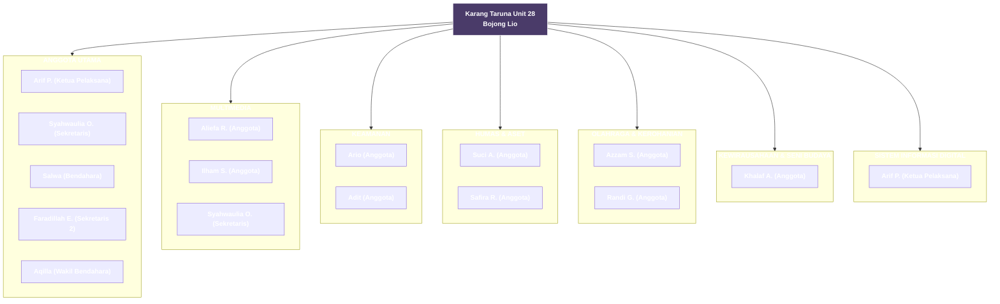

# Profil Resmi Karang Taruna Unit 28 — Kampung Bojong Lio

Website profil resmi **Karang Taruna Unit 28 Kampung Bojong Lio** dengan gaya *retro / pixel* ala video game (istilah *"Current Quests"*, *"Party Member"*, dll). Seluruh konten kini **data-driven**: struktur organisasi, quest/misi, dan terjemahan dipisah ke file data yang bisa diedit secara manual (hardcode) tanpa menyentuh logika tampilan.

---

## 📁 Struktur File

```
index.html              # Markup halaman (tanpa CSS/JS inline)
css/style.css           # Seluruh styling + animasi + sprite dekoratif
js/data/
  config.js             # Pengaturan: WA, video YT, volume, urutan bahasa
  translations.js       # Teks terjemahan ID / EN / JP
  divisions.js          # Data divisi & anggota (nama, role, deskripsi)
  quests.js             # Data quest/misi (judul, desc, waktu, lokasi, PIC)
js/func/
  audio-sfx.js          # Efek suara (Web Audio API)
  youtube.js            # Musik latar (YouTube Iframe API)
  i18n.js               # Logika ganti bahasa
  team.js               # Render grid divisi + modal anggota
  quests.js             # Render daftar quest dari data
  typewriter.js         # Animasi teks ketik (hero)
  contact.js            # Kirim pesan ke WhatsApp
  main.js               # Inisialisasi & event listener (scroll-spy, dll)
```

---

## 👥 Struktur Anggota

```
━━━━━━━━━━━━━━━
ANGGOTA UTAMA
━━━━━━━━━━━━━━━
* Arif Permana Putrasuryana (RT.1)
└ Ketua Pelaksana

* Arif (Bono)
└ Wakil Ketua Pelaksana

* Syahwaulia Oktaviandri (RT.2)
└ Sekretaris

* Salwa (RT.1)
└ Bendahara

* Faradillah Eka (RT.1)
└ Sekretaris 2

* Aqilla (RT.1)
└ Wakil Bendahara

━━━━━━━━━━━━━━━
MULTIMEDIA
━━━━━━━━━━━━━━━
* Aliefa Ramadanti (RT.1)
└ Anggota

* Ilham Syahwandi
└ Anggota

* Syahwaulia Oktaviandri (RT.2)
└ Sekretaris

━━━━━━━━━━━━━━━
KEAMANAN
━━━━━━━━━━━━━━━
* Arif (Bono) (RT.1)
└ Anggota

* Adit
└ Anggota

━━━━━━━━━━━━━━━
HUMAS & ASET
━━━━━━━━━━━━━━━
* Suci Al Desti Febriyani
└ Anggota

* Safira Rahmadini
└ Anggota

━━━━━━━━━━━━━━━
OLAHRAGA & KEROHANIAN
━━━━━━━━━━━━━━━
* Muhammad Azzam Syuhada (RT.5)
└ Anggota

* Randi Gunawan (RT.5)
└ Anggota

━━━━━━━━━━━━━━━
KEWIRAUSAHAAN & SENI BUDAYA
━━━━━━━━━━━━━━━
* Khalaf Aidil Muzhaffar
└ Anggota

━━━━━━━━━━━━━━━
SISTEM INFORMASI DIGITAL
━━━━━━━━━━━━━━━
* Arif Permana Putrasuryana (RT.1)
└ Ketua Pelaksana
```

---

## 🧭 Sistem per Divisi & Tanggung Jawab Anggota

### ANGGOTA UTAMA
Penggerak utama organisasi. Bertugas memimpin, merumuskan rencana kerja, dan memegang tanggung jawab akhir seluruh program.

| Nama | Jabatan | Tanggung Jawab |
|------|---------|----------------|
| Arif Permana Putrasuryana (RT.1) | Ketua Pelaksana | Memimpin organisasi, pengambilan keputusan strategis, koordinasi lintas divisi, penanggung jawab utama program. |
| Syahwaulia Oktaviandri (RT.2) | Sekretaris | Administrasi, notulensi rapat, surat-menyurat & dokumen resmi. |
| Salwa (RT.1) | Bendahara | Pengelolaan keuangan, kas organisasi, pencatatan pemasukan & pengeluaran. |
| Faradillah Eka (RT.1) | Sekretaris 2 | Mendukung sekretaris, arkhip digital & komunikasi internal. |
| Aqilla (RT.1) | Wakil Bendahara | Membantu bendahara & verifikasi laporan keuangan. |

### MULTIMEDIA
Mendidokumentasikan kegiatan dan mengelola publikasi visual organisasi.

| Nama | Jabatan | Tanggung Jawab |
|------|---------|----------------|
| Aliefa Ramadanti (RT.1) | Anggota | Dokumentasi foto & video kegiatan. |
| Ilham Syahwandi | Anggota | Produksi konten & editing. |
| Syahwaulia Oktaviandri (RT.2) | Sekretaris | Merangkap sekretaris: pencatatan & dokumentasi kegiatan. |

### KEAMANAN
Menjaga ketertiban dan keamanan selama kegiatan maupun acara kampung.

| Nama | Jabatan | Tanggung Jawab |
|------|---------|----------------|
| Ario (RT.1) | Anggota | Pengamanan lapangan & posko. |
| Adit | Anggota | Pengaturan arus, parkir & patroli. |

### HUMAS & ASET
Menjalin relasi eksternal, mengelola aset, dan menangani komunikasi publik.

| Nama | Jabatan | Tanggung Jawab |
|------|---------|----------------|
| Suci Al Desti Febriyani | Anggota | Hubungan masyarakat & kerja sama pihak luar. |
| Safira Rahmadini | Anggota | Inventarisasi & penjagaan aset organisasi. |

### OLAHRAGA & KEROHANIAN
Menyelenggarakan kegiatan olahraga, kerohanian, dan kebugaran warga.

| Nama | Jabatan | Tanggung Jawab |
|------|---------|----------------|
| Muhammad Azzam Syuhada (RT.5) | Anggota | Penyelenggara kegiatan olahraga. |
| Randi Gunawan (RT.5) | Anggota | Kegiatan kerohanian & kebugaran. |

### KEWIRAUSAHAAN & SENI BUDAYA
Mengembangkan ekonomi kreatif, kewirausahaan, dan melestarikan seni budaya lokal.

| Nama | Jabatan | Tanggung Jawab |
|------|---------|----------------|
| Khalaf Aidil Muzhaffar | Anggota | Pengembangan usaha & pelestarian seni budaya. |

### SISTEM INFORMASI DIGITAL
Membangun & merawat sistem informasi digital (website, aplikasi, basis data).

| Nama | Jabatan | Tanggung Jawab |
|------|---------|----------------|
| Arif Permana Putrasuryana (RT.1) | Ketua Pelaksana | Pengembangan & pemeliharaan sistem digital organisasi. |

---

## 🗺️ Flowchart Struktur Organisasi (Mermaid)



---

## 📊 Ringkasan Divisi (Tabel)

| Divisi | Ikon | Jumlah Anggota | Fokus Utama |
|--------|------|:--------------:|-------------|
| Anggota Utama | 👑 | 5 | Kepemimpinan & koordinasi |
| Multimedia | 📷 | 3 | Dokumentasi & konten visual |
| Keamanan | 🛡️ | 2 | Ketertiban & keamanan acara |
| Humas & Aset | 📣 | 2 | Relasi publik & aset |
| Olahraga & Kerohanian | 🏃 | 2 | Kebugaran & kegiatan rohani |
| Kewirausahaan & Seni Budaya | 🏪 | 1 | Usaha & pelestarian budaya |
| Sistem Informasi Digital | 💻 | 1 | Website & aplikasi organisasi |

---

## ➕ Cara Menambah ANGGOTA BARU

Buka `js/data/divisions.js`, cari divisi tujuan, lalu tambahkan object baru ke dalam array `members`:

```js
members: [
    // ...anggota yang sudah ada...
    { name: "Nama Baru (RT.x)", role: { id: "Jabatan ID", en: "Role EN", jp: "役職 JP" } }
]
```

- `name`  : nama lengkap + RT (boleh "(Empty)" jika kosong).
- `role`  : jabatan dalam 3 bahasa.

Jumlah anggota di kartu divisi **dihitung otomatis** — tidak perlu diubah manual.

Untuk divisi baru, salin satu blok `namaDivisi: { icon, title, desc, members: [...] }` dan isi `icon` (class Font Awesome), `title` & `desc` (3 bahasa), lalu `members`.

---

## ➕ Cara Menambah QUEST / MISI BARU

Buka `js/data/quests.js`. Setiap quest adalah satu object di dalam array `questData`. Tambahkan object baru:

```js
{
    id: "nama-unik-quest",                       // tanpa spasi, unik
    icon: "fas fa-flag",                         // class Font Awesome
    title: {
        id: "PERSIAPAN TUJUH BELASAN",
        en: "INDEPENDENCE DAY PREP",
        jp: "独立記念日の準備"
    },
    desc: {
        id: "Menyiapkan berbagai perlombaan...",
        en: "Preparing various competitions...",
        jp: "独立記念日を祝うための..."
    },
    datetime: "2026-08-17 08:00",               // bebas, mis. "Setiap Minggu"
    location: "Lapangan Bojong Lio",            // tempat pelaksanaan
    pic: "Arif Permana Putrasuryana"            // Penanggung Jawab (PIC)
}
```

**Penjelasan field:**
| Field | Fungsi |
|-------|--------|
| `id` | Identifier unik (keperluan teknis). |
| `icon` | Ikon Font Awesome yang ditampilkan di kartu. |
| `title` / `desc` | Judul & deskripsi dalam 3 bahasa. |
| `datetime` | Waktu pelaksanaan (bebas format). |
| `location` | Lokasi pelaksanaan. |
| `pic` | Penanggung jawab (Person In Charge). |

Urutan object di dalam array = urutan tampil di website. Tidak perlu mengubah `index.html`.

---

## 🎨 Penjelasan Perbaikan UI & UX

Beberapa perbaikan yang diterapkan agar website lebih rapi & nyaman:

1. **Pemisahan CSS & JS** — styling dan logika dipisah ke file sendiri agar mudah dirawat.
2. **Data-driven (HTML netral)** — divisi, anggota, dan quest di-render dari file data, sehingga menambah konten tidak mengubah struktur HTML.
3. **Animasi Typewriter** — teks sambutan di beranda mengetik secara dinamis (berganti sesuai bahasa).
4. **Sprite dekoratif** — elemen mengambang (matahari, awan, bintang, daun, hati, dll) memberi kesan *headspace* yang hidup namun tetap rapi (`pointer-events: none` agar tidak mengganggu klik).
5. **Scroll-spy navigasi** — menu navigasi (atas & bawah) otomatis menyorot section yang sedang dilihat melalui `IntersectionObserver`.
6. **Indikator scroll** — petunjuk "GULIR KE BAWAH" bergaya pantulan di beranda.
7. **Meta quest yang jelas** — tiap quest kini menampilkan **waktu, lokasi, dan PIC** dalam label rapi.
8. **Modal divisi lebih informatif** — menampilkan deskripsi tugas divisi sebelum daftar anggota.
9. **Konsistensi desain** — semua kartu menggunakan kelas `.omori-box` dan palet *pastel* seragam.
10. **Aksesibilitas bahasa** — tombol bahasa (ID/EN/JP) langsung memperbarui teks, quest, dan typewriter.

---

## 🚀 Cara Menjalankan

Cukup buka `index.html` di browser (atau deploy ke Vercel/Netlify). Tidak ada build step karena semua file statis.

> 💡 Untuk menguji secara lokal dengan baik (karena memuat YouTube & font eksternal), gunakan *live server* atau host statis sederhana.
